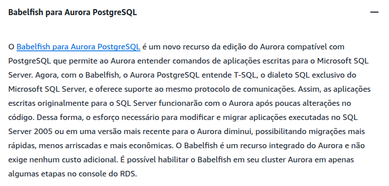

# RELATÓRIO DE IMPLEMENTAÇÃO DE SERVIÇOS AWS

Data: 15/06/2025 \
Empresa: Abstergo Industries \
Responsável: Claudio André (BootCamp Co.)

## Introdução

Este relatório apresenta o processo de implementação de ferramentas na empresa Abstergo Industries, realizado por
Claudio André. O objetivo do projeto foi elencar 3 serviços AWS, com a finalidade de realizar diminuição de custos
imediatos.

## Descrição do Projeto

O projeto de implementação de ferramentas foi dividido em 3 etapas, cada uma com seus objetivos específicos. A seguir,
serão descritas as etapas do projeto:

Etapa 1:

- Amazon Simple Storage Service (S3);
- Foco da ferramenta e seus objetivos:
  - Armazenar os backups em local seguro, de forma durável, com redundância no armazenamento e de forma auditável.
- Descrição de caso de uso:
  - Ao invés de usar mídias portáteis que podem extraviar ou não serem mais acessíveis no futuro quando os
    gravadores/leitores desta tecnologia se tornarem obsoletos, usar o armazenamento na nuvem.
  - **Valor**: aumentar a transparência e a confiabilidade dos dados armazenados nos backups.
  - **Narrativa do Usuário**:
    - **Como** colaborador
    - **Eu quero** mecanismos simples e automação;
    - **Para** realizar o backup dos dados da empresa.

Etapa 2:

- AWS File Gateway
- Foco da ferramenta e seus objetivos:
  - Permite que os colaboradores acessem e trabalhem em arquivos armazenados em vários locais, seja na nuvem ou
    localmente;
  - Prover um servidor (virtual) e seguro de espaço de armazenamento; permitir a troca de dados entre computadores e
    entre os escritórios e filiais; facilitar o controle de acesso e backups dos dados não estruturados da empresa;
  - Permitir que a empresa armazene e recupere arquivos na nuvem usando protocolos tradicionais baseados em arquivos,
    como NFS e SMB. O serviço permite que a empresa integre seus aplicativos e cargas de trabalho locais à nuvem sem
    substituir sua infraestrutura de armazenamento baseada em arquivos.
- Descrição de caso de uso:
  - Ao invés de usar uma miríade de soluções, servidores, envio de emails e pendrives, migrar para o armazenamento na
    nuvem.
  - **Valor**: simplificar a troca de informações, aumentar a transparência e simplificar os backups.
  - **Narrativa do Usuário**:
    - **Como** colaborador
    - **Eu quero** mecanismos simples e automação
    - **Para** salvar os dados corporativos
    - **E** para trocar informações entre diferentes colaboradores.

Etapa 3:

- Amazon Aurora com Babelfish for Aurora PostgreSQL
- Foco da ferramenta e seus objetivos:
  - Permitir que se execute aplicações SQL Server herdadas/legadas usando um banco de dados Serverless como o Aurora.
  - O Aurora Serverless v2 é a configuração sob demanda com auto escalabilidade do Amazon Aurora que nos permite usar um
    banco de dados relacional no modelo Serverless.
- Descrição de caso de uso:
  - Com o mínimo de alteração de código, transferir o banco de dados corporativo (SQL Server) para a nuvem em uma
    modalidade serverless;
  - Utilizar toda infraestrutura que a nuvem oferece para reduzir os custos, automatizar a manutenção do banco, aumentar
    a disponibilidade e segurança dos dados;
  - Lidar de forma transparente com cargas de trabalho variável que naturalmente ocorrem sem ter que provisionar a mais
    os recurso de banco de dados.
  - **Valor**: reduzir os custos com banco de dados, automatizar o auto escalonamento e simplificar a administração do
    banco.
  - **Narrativa do Usuário**:
    - **Como** colaborador
    - **Eu quero** usar um banco de dados serverless
    - **Para** simplificar a gestão e reduzir custos de usar banco de dados relacionais.

## Conclusão

A implementação de ferramentas na empresa _Abstergo Industries tem como esperado aumentado a segurança e durabilidade
dos dados, otimizado as rotinas de trabalho através da automatização da transferência de dados entre os colaboradores e
escritórios, tudo isto sem o provisionamento de servidores (somos serverless) e sem necessidade de aumentar o time de
TI_, o que aumentará a eficiência e a produtividade da empresa. Recomenda-se a continuidade da utilização das
ferramentas implementadas e a busca por novas tecnologias que possam melhorar ainda mais os processos da empresa.

## Anexos

1. Gateway de Arquivos

   

2. Informações Sobre o Babelfish

   

---

Assinatura do Responsável pelo Projeto:

Claudio André \
São Paulo, 15 de Junho de 2025.
