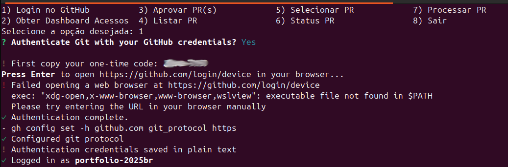
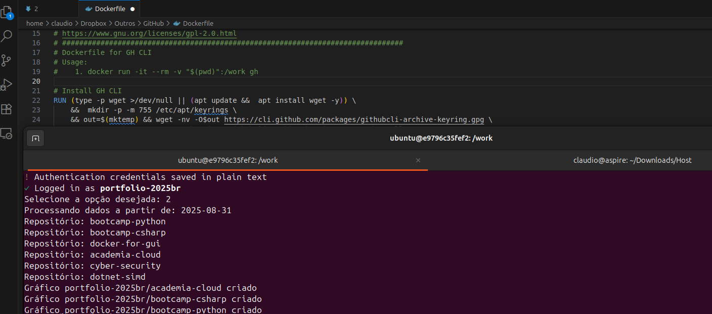

# Automação no GitHub

O profissional DevOps pode (e deve) ter um arsenal de ferramentas para auxiliar a realização de seus afazeres do
dia-a-dia. Isto se deve tanto à necessidade de agilizar o trabalho quanto para tornar o processo repetível e menos
susceptível a erros.

### Conclusão

Digitar comandos na CLI ou mesmo controlar a interface web das plataformas é uma atividade que exige atenção e
conhecimentos técnicos. Os profissionais precisam investir em automação para tornar este processo repetível e mais
seguro.

## Evidências

Eu criei um programa que me ajuda na realização de tarefas repetitivas dentro do GitHub. Usando uma forma de
autenticação segura, sem a criação de Tokens ou coisas assim, eu me autentico na plataforma e posso realizar tarefas
cotidianas como aprovar PRs, postar comentários, etc.

- Login via OAUTH no GitHub para uso pela CLI:

- Posso automatizar tarefas de meu interesse, como por exemplo, obter os dados e criar a Dashboard de acessos aos
  repositórios do GitHub:

