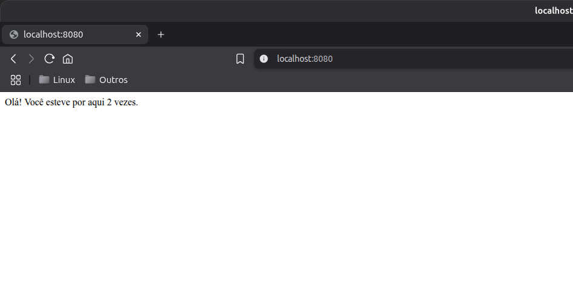
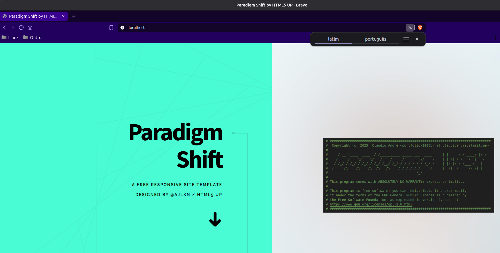

# DIO - Trilha End-to-End - Contêineres com Docker

<www.dio.me>

## Desafio de projeto

Para este desafio, você precisará usar seus conhecimentos adquiridos no módulo de Contêineres com Docker, da trilha
Engenheiro End-to-End da DIO.

## Contexto

Neste projeto você irá utilizar o Docker Compose para executar uma aplicação HTML em um Container Apache.

## Solução

Pontos a destacar na minha solução:

### Conteúdo Dinâmico

- Criação de um contador de acessos simples usando Redis:
  - Python + Flask acessando o redis.

### Conteúdo Estático

- Uso de Apache para servir páginas simples HTML 5;

