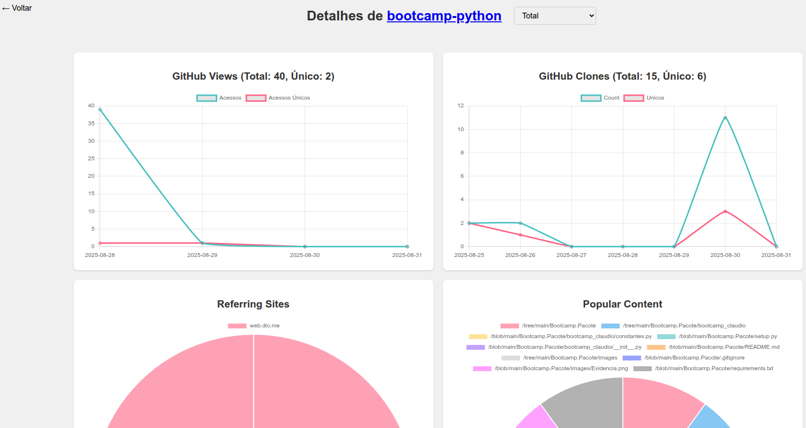

# Dashboard de Acessos no GitHub

Baseado em exemplos da comunidade eu adaptei e desenvolvi uma ferramenta para coletar e visualizar o histórico de
tráfego dos repositórios do GitHub.

## Estatísticas de tráfego dos repositórios GitHub

Uma interface web simples para visualizar as estatísticas localmente (ou hospedadas no GitHub Pages). Eu uso localmente.

Como os dados são armazenados localmente, isto nos permite manter o histórico por um período superior aos 14 dias
oferecidos pelo GitHub.

### Conclusão

Usando exemplos criados pela comunidade e a CLI do GitHub, eu adaptei e desenvolvi um dashboard que lista o histórico de
tráfego aos meus repositórios.

## Evidências

- Página principal do Dashboard:

- Exemplo de histórico de acessos a um dos repositórios no GitHub:

