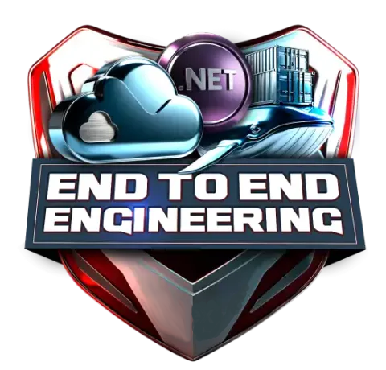

# Portfolio (DevOps e Full Stack Developer)

<!-- markdownlint-disable MD033 -->

[![Licença][shieldLicense]](LICENSE.txt)

Este repositório é parte do meu portfolio

## Índice

1. [Introdução](#introdução)
2. [Sobre Este Projeto](#sobre-este-projeto)
3. [Sobre Mim](#sobre-mim)
4. [Contribuir](#contribuir)
5. [Agradecimentos e Contato](#agradecimentos-e-contato)
6. [Licença](#licença)

## Introdução

> [!IMPORTANT]
>
> Este é um projeto usado para projeto, desenvolvimento e testes de software PoC.

(<a href="#header">voltar ao topo</a>)

## Sobre Este Projeto

Este projeto tem como objetivo criar experimentos, ferramentas e procedimentos de automação para avaliar e simular o
dia-a-dia de um engenheiro end-to-end. Isto será feito desenvolvendo-se código e um pipeline de CI e CD.

Pontos a destacar nos projetos contidos neste repositório:

- atualização automática de dependências usando-se o Dependabot;
- verificação ortografia automática para português e inglês usando-se o `check-spelling`;
- uso de
  [commits assinados](https://docs.github.com/pt/authentication/managing-commit-signature-verification/signing-commits)
  para garantir a autenticidade e integridade das mudanças de código;
- análise estática de código [1]:
  - localmente usando SonarQube via extensão do Visual Studio Code;
  - usando-se workflows CodeQL, workflows com linters e scanners de segurança no GitHub.
- definição de padrões e aplicação (enforcement) automático via workflows:
  - verificação dos padrões de formatação de código com `.editorconfig` e `dotnet format`;
  - verificação dos padrões de formatação de documentos Markdown, JSON, TypeScript, etc., com o `super-linter`.
- utilização do Visual Studio Code Remote Development [2].

Portanto, se alguma regra de formatação ou erro que possa ser detectado pela análise estática de código falhar os
workflows falham, e os mantenedores serão automaticamente notificados.

[1] As ferramentas avaliam qualidade de código, escaneiam vulnerabilidades (CVE), falhas de configuração (IaC) e fazem
verificação para evitar que segredos sejam expostos.

[2] O Visual Studio Code Remote Development nos permite usar um contêiner como um ambiente de desenvolvimento com todos
os recursos. Eu o utilizo como um
[ambiente de construção em sandbox](https://code.visualstudio.com/docs/remote/containers) pois ele me permite manter a
máquina “host” limpa. Outra vantagem é a possibilidade de escolher livremente o ambiente de desenvolvimento de acordo
com a necessidade, podemos usar o Ubuntu LTS, ou a versão mais recente, ou o Fedora, ..., sem nenhum impacto ou
necessidade de instalação de software na máquina "host".

(<a href="#header">voltar ao topo</a>)

## Sobre Mim

Sou pós graduado em Engenharia de Software, moro no Vale do Paraíba e tenho duas certificações Azure:

- Microsoft Certified: Azure Fundamentals
- Microsoft Certified: Azure Data Fundamentals

[Veja todos meus badges](https://www.credly.com/users/claudioandre-br).

(<a href="#header">voltar ao topo</a>)

## Contribuir

Contribuições na forma de issues e pull requests são sempre bem-vindas!

(<a href="#header">voltar ao topo</a>)

## Agradecimentos e Contato

Nós temos orgulho de ser _Powered by Open Source Community_:

- [Fale conosco via Issue ou Discussion](https://github.com/portfolio-2025br/bootcamp-csharp/discussions).

(<a href="#header">voltar ao topo</a>)

## Licença

GNU General Public License v2.0.

(<a href="#header">voltar ao topo</a>)

<!-- markdownlint-enable MD033 -->

[shieldLicense]: https://img.shields.io/badge/License-GPL%20v2-blue.svg?label=Licen%C3%A7a
